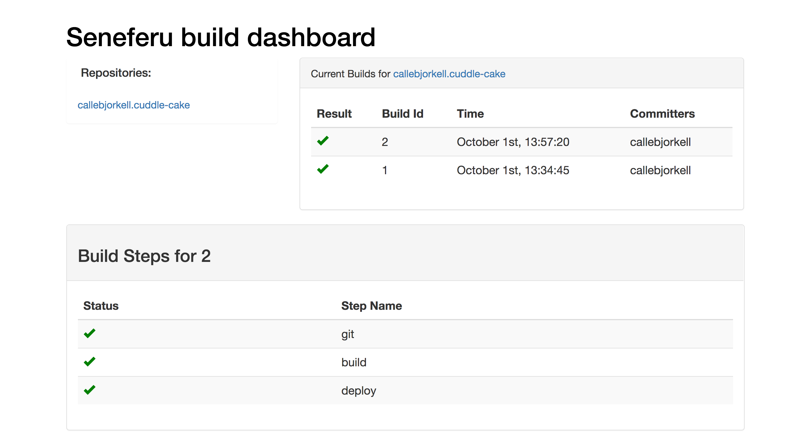

Simple Kubernetes based build

Named after the pharo that build 3 pyramids, because he was surely awesome... like this tools

Build in 24 hours in the Tradeshift Hackathon 2017, the code is __utterly crap__ and thrown
together be 4 sleep deprived ponies, but the concept seems to
be working.

__DO NOT USE IN PRODUCTION__ or well that's up to you I guess.


Build system that schedules build in a pod in a Kubernetes cluster.
That way we can leverage Kubernetes for scaling and reliability.


# Screenshot




# Building

`go build`

# Running

Start Seneferu, and configure a Github webhook to point to http://your-server.com/webhook

When a push event is triggered on Github, Seneferu will then receive the payload and start a build.
The build will be executed in the same Kubernetes cluster as the build server is running in.


```
Usage of ./seneferu:
  -alsologtostderr
    	log to standard error as well as files
  -github_token string
    	Github secret token, needs to match the one on Github
  -kubeconfig string
    	Kubernetes Config File
  -log_backtrace_at value
    	when logging hits line file:N, emit a stack trace
  -log_dir string
    	If non-empty, write log files in this directory
  -logtostderr
    	log to standard error instead of files
  -stderrthreshold value
    	logs at or above this threshold go to stderr
  -v value
    	log level for V logs
  -vmodule value
    	comma-separated list of pattern=N settings for file-filtered logging
```

Build repositories that contains a .ci.yaml file

.ci.yaml example

```yaml
pipeline:
  build:
    group: build
    image: golang:latest
    commands:
      - go build
      - go test
      - docker build -t sorenmat/test:${HASH} .
```

# Building and running tests

`go build` create a server binary that can be executed from the commandline


# FAQ

1. How do i add environment variables to my build step

```yaml
pipeline:
  build:
    group: build
    image: golang:latest
    environment:
        - NAME=testing
    commands:
      - echo ${NAME}

```

2. Known environment variables
   `GIT_REF` ref to the git hash being build, the head of the branch


# Contributers

Soren Mathiasen @sorenmat

Carl-Magnus Björkell @callebjorkell
 
Christian Nilsson @nchrisdk
 
Nicolai Willems @nwillems
 

